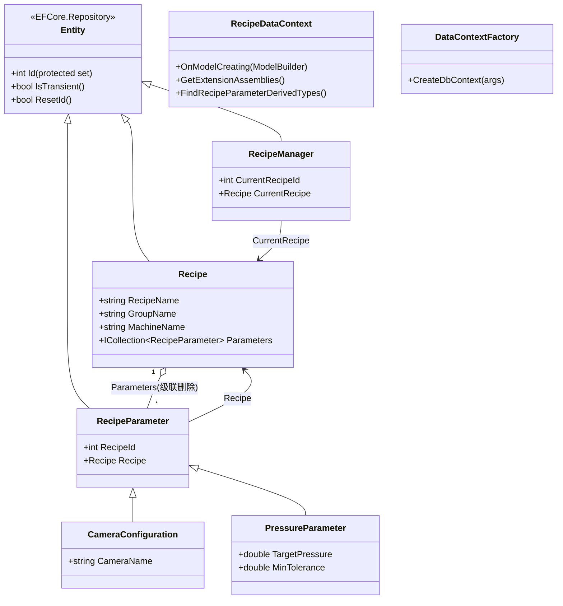
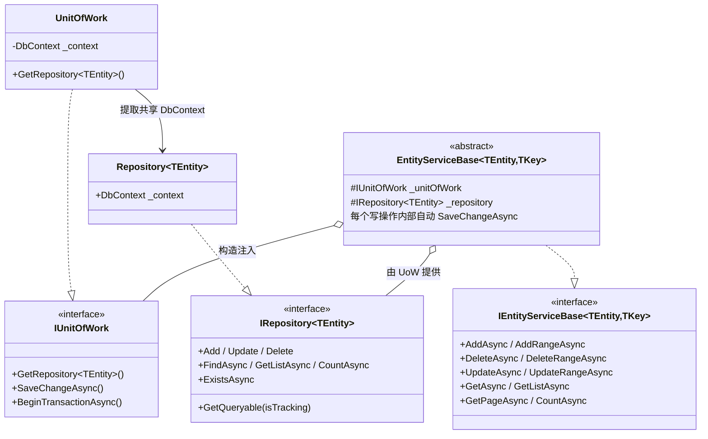
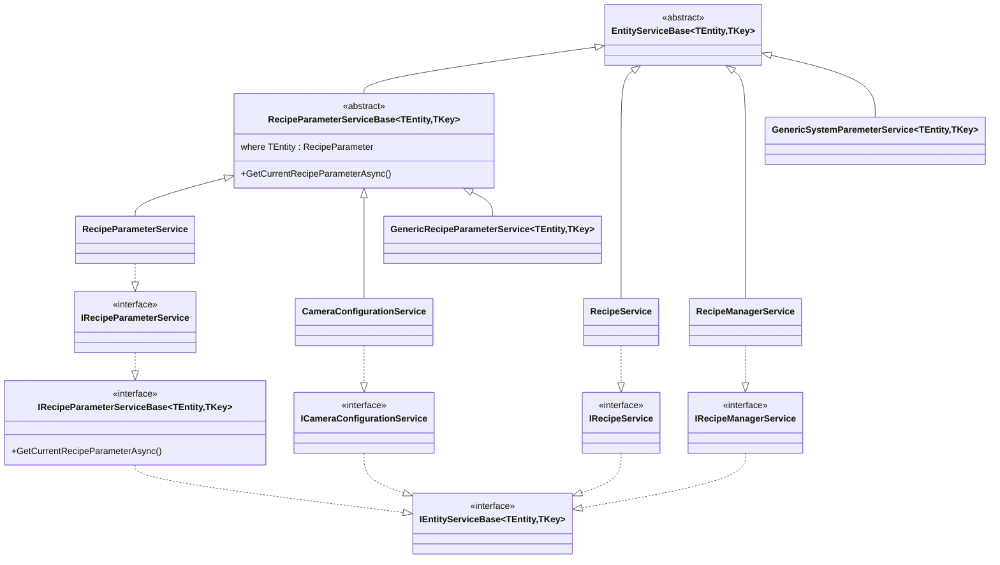

# Recipe 配方系统类图

> 用于理解 Recipe 配方系统的整体架构（领域实体 / 通用仓储基座 / 服务实现）。
>
> 最后更新：2026-08-19

## 图 1：领域实体与继承体系

> `PressureParameter` 位于 `UI.FrameWork/Test/`，是"插件式实体"的演示（装配 `[assembly: DefaultDbContext]` 特性即可被自动发现）。

## 图 2：通用仓储基座（EFCore.Repository / Infrastructure）

## 图 3：Recipe 服务层（Recipe.Infrastructure）

## 架构要点解读

1. **调用链**：`ViewModel → IRecipeService → EntityServiceBase → IRepository<T> → DbContext → SQLite`
2. **模板方法基座**：`EntityServiceBase` 封装了"仓储操作 + 自动 SaveChange"，所有业务服务只需继承它，零样板代码。
3. **当前配方查询**：`RecipeParameterServiceBase.GetCurrentRecipeParameterAsync()` 通过 `IoC.Get<IRecipeManagerService>()` 读取 `RecipeManager.CurrentRecipeId`，再按 `RecipeId` 过滤参数 —— 这是配方系统的核心业务路径。
4. **TPC 插件机制**：`RecipeParameter` 基类配置了 `UseTpcMappingStrategy()`，每个派生类（如 `CameraConfiguration`、插件里的 `PressureParameter`）独立建表。`RecipeDataContext` 启动时扫描带 `[assembly: DefaultDbContext]` 特性的程序集，自动把派生类加入模型。
5. **DI 双保险**（`ServiceExtensions.AddRecipeServices`）：
   - 内置实体走**闭合注册**（`IRecipeService → RecipeService` 等 4 个）
   - 插件实体走**开放泛型兜底**（`IRecipeParameterServiceBase<,> → GenericRecipeParameterService<,>`），所以插件无需改框架代码即可注册自己的参数服务。

## 已知怪癖

- 实体主键 `Entity.Id` 是 `int`，但服务泛型 `TKey` 用的是 `Guid`。
- `IEntityServiceBase` 的命名空间是 `EFCore.IRepository`，而文件在 `EFCore.Repository` 项目里，引用时别弄混。
- `GenericSystemParemeterService` 类名存在拼写错误（Paremeter），沿用原名避免混淆。
